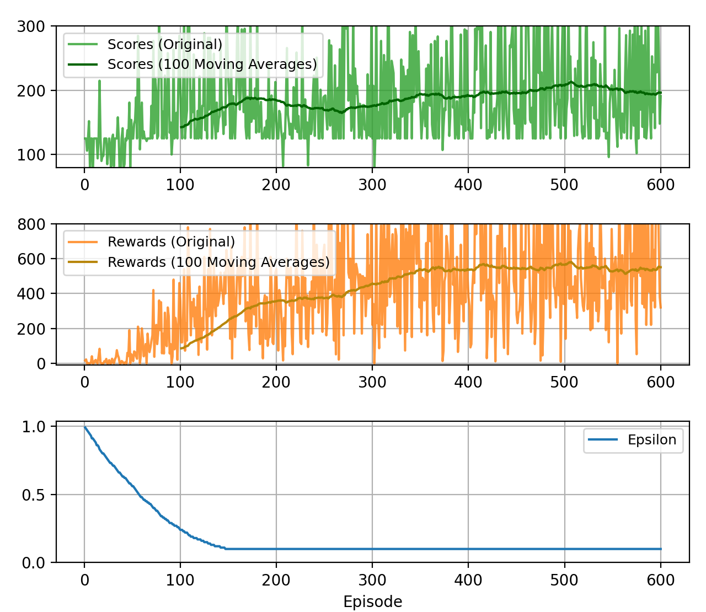

# DQN

Training machines to play CarRacing 2d from OpenAI GYM by implementing Deep Q Learning/Deep Q Network(DQN) with TensorFlow and Keras as the backend.

### Training Results
We can see that the scores(time frames elapsed) stop rising after around 500 episodes as well as the rewards. Thus let's terminate the training and evaluate the model using the last three saved weight files.
 

 

 

 

## File Structure

- `train_model.py` The training program.
- `CommonFunctions.py` Some functions that will be used in multiple programs will be put in here.
- `CarRacingDQNAgent.py` The core DQN class. Anything related to the model is placed in here.
- `model.py` The program for playing CarRacing by the model.
- `keyboardModel.py` The program for playing CarRacing with the keyboard.
- `save/` The default folder to save the trained model.

